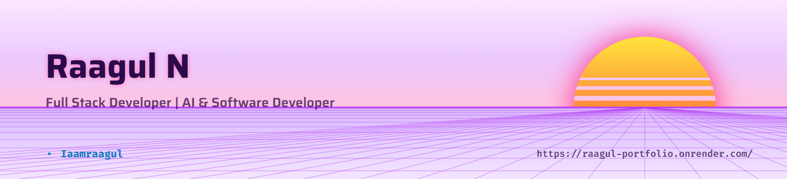
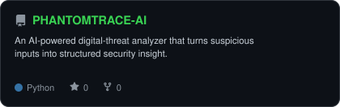
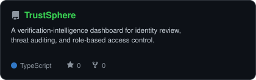
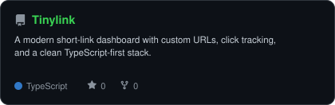
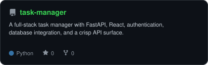
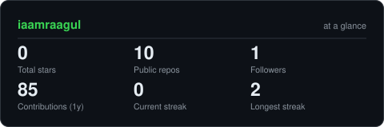
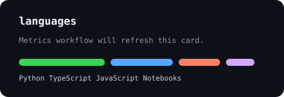

<div align="center">

<!-- PREMIUM FRONT BANNER -->
<picture>
  <source media="(prefers-color-scheme: dark)" srcset="assets/header-dark.png">
  <source media="(prefers-color-scheme: light)" srcset="assets/header-light.png">
  
</picture>

<br><br>

<!-- HERO PROFILE PICTURE - generated from your photo with the reference dot-matrix reveal effect -->


<br>

<a href="https://github.com/iaamraagul">
  
</a>

<br>


<br><br>

<a href="mailto:nraagul@gmail.com"></a>
<a href="https://www.linkedin.com/in/iaamraagul/"></a>
<a href="https://github.com/iaamraagul"></a>
<a href="https://raagul-portfolio.onrender.com/"></a>
<a href="resume.pdf"></a>

</div>

<br>


## `~/` about me

<table>
<tr>
<td width="58%" valign="top">

```console
$ whoami
```

I'm **Raagul N**, a B.Tech graduate in Electronics and Computer Engineering from **Chennai**.
I enjoy turning complex technical problems into smart, usable, real-world systems.

My strongest work sits at the intersection of **machine learning**, **healthcare technology**,
**full-stack development**, and **security-minded engineering**. I have built deep learning
systems for medical image analysis, responsive web applications, dashboards, authentication
flows, and practical tools that move from idea to interface.

- Focused on **AI/ML, full-stack engineering, healthcare tech, and cybersecurity**
- Experienced with **Python, TensorFlow, React, Node.js, MongoDB, SQL, and Git**
- Built projects around **retinal disease detection, cancer segmentation, URL systems, task apps, and security analysis**
- Portfolio: **[raagul-portfolio.onrender.com](https://raagul-portfolio.onrender.com/)**
- Resume: **[download resume.pdf](resume.pdf)**

</td>
<td width="42%" align="center" valign="middle">


</td>
</tr>
</table>


## `~/` skills

<table>
<tr>
<td width="50%" valign="top">

### core strengths

| area | what I work with |
|---|---|
| **AI / ML** | Deep Learning, Computer Vision, Image Processing, NLP, Classification, Regression |
| **Full Stack** | React, Node.js, Express, FastAPI, REST APIs, Authentication, Responsive UI |
| **Data** | SQL, MySQL, MongoDB, data preprocessing, validation, cleaning pipelines |
| **Security** | Network security fundamentals, Linux, Kali tools, penetration testing basics |
| **Engineering** | Git, GitHub, VS Code, AWS basics, browser dev tools, practical debugging |

</td>
<td width="50%" align="center" valign="middle">

<picture>
  <source media="(prefers-color-scheme: dark)" srcset="assets/radar-dark.svg">
  <source media="(prefers-color-scheme: light)" srcset="assets/radar-light.svg">
  
</picture>

</td>
</tr>
</table>

<div align="center">

## `~/` tech stack


<br><br>


</div>

---

## `~/` featured projects

<table>
<tr>
<td width="50%" valign="top">
  <a href="https://github.com/iaamraagul/PHANTOMTRACE-AI">
    <picture>
      <source media="(prefers-color-scheme: dark)" srcset="assets/card-PHANTOMTRACE-AI-dark.svg">
      <source media="(prefers-color-scheme: light)" srcset="assets/card-PHANTOMTRACE-AI-light.svg">
      
    </picture>
  </a>
</td>
<td width="50%" valign="top">
  <a href="https://github.com/iaamraagul/TrustSphere">
    <picture>
      <source media="(prefers-color-scheme: dark)" srcset="assets/card-TrustSphere-dark.svg">
      <source media="(prefers-color-scheme: light)" srcset="assets/card-TrustSphere-light.svg">
      
    </picture>
  </a>
</td>
</tr>
<tr>
<td width="50%" valign="top">
  <a href="https://github.com/iaamraagul/Tinylink">
    <picture>
      <source media="(prefers-color-scheme: dark)" srcset="assets/card-Tinylink-dark.svg">
      <source media="(prefers-color-scheme: light)" srcset="assets/card-Tinylink-light.svg">
      
    </picture>
  </a>
</td>
<td width="50%" valign="top">
  <a href="https://github.com/iaamraagul/task-manager">
    <picture>
      <source media="(prefers-color-scheme: dark)" srcset="assets/card-task-manager-dark.svg">
      <source media="(prefers-color-scheme: light)" srcset="assets/card-task-manager-light.svg">
      
    </picture>
  </a>
</td>
</tr>
</table>

| project | stack | highlight |
|---|---|---|
| **[PHANTOMTRACE-AI](https://github.com/iaamraagul/PHANTOMTRACE-AI)** | `Python` `AI` `Security` | Intelligent threat analysis for digital risk signals |
| **[TrustSphere](https://github.com/iaamraagul/TrustSphere)** | `TypeScript` `Angular` `Express` | Verification intelligence, RBAC, audit logs, security workflows |
| **[Tinylink](https://github.com/iaamraagul/Tinylink)** | `Next.js` `TypeScript` `PostgreSQL` | Custom short links, analytics, and clean dashboard UX |
| **[task-manager](https://github.com/iaamraagul/task-manager)** | `FastAPI` `React` `Auth` | Full-stack API, authentication, and database integration |
| **[Diabetic Retinopathy Detection](https://github.com/iaamraagul/Diabetic-Retinopathy-Disease-Detections-Using-Deep-Learning)** | `TensorFlow` `CNN` `Python` | Deep learning diagnosis support from retinal images |
| **[Cancer Detection](https://github.com/iaamraagul/Cancer-Detection-using-deep-learning-)** | `SegFormer` `Python` `DL` | Transformer-based image segmentation for cancer detection |

---

<div align="center">

## `~/` github analytics

<table>
<tr>
<td width="50%">
  <picture>
    <source media="(prefers-color-scheme: dark)" srcset="assets/card-stats-dark.svg">
    <source media="(prefers-color-scheme: light)" srcset="assets/card-stats-light.svg">
    
  </picture>
</td>
<td width="50%">
  
</td>
</tr>
</table>

<table>
<tr>
<td width="50%">
  
</td>
<td width="50%">
  <picture>
    <source media="(prefers-color-scheme: dark)" srcset="assets/radar-langs-dark.svg">
    <source media="(prefers-color-scheme: light)" srcset="assets/radar-langs-light.svg">
    
  </picture>
</td>
</tr>
</table>


<br><br>


</div>

---

## `~/` open source

<table>
<tr>
<td width="33%" align="center">
  
  <br><br>
  I keep projects public when they can help someone learn, inspect, or build faster.
</td>
<td width="33%" align="center">
  
  <br><br>
  Most of my work connects intelligent systems with practical product interfaces.
</td>
<td width="33%" align="center">
  
  <br><br>
  Code is poetry; I just like to keep it concise.
</td>
</tr>
</table>

<div align="center">

<picture>
  <source media="(prefers-color-scheme: dark)" srcset="https://raw.githubusercontent.com/iaamraagul/iaamraagul/output/snake-dark.svg">
  <source media="(prefers-color-scheme: light)" srcset="https://raw.githubusercontent.com/iaamraagul/iaamraagul/output/snake.svg">
  
</picture>

</div>

---

<div align="center">

## `~/` contact

<table>
<tr>
<td align="center" width="25%">
  <a href="mailto:nraagul@gmail.com">
    
  </a>
</td>
<td align="center" width="25%">
  <a href="https://www.linkedin.com/in/iaamraagul/">
    
  </a>
</td>
<td align="center" width="25%">
  <a href="https://raagul-portfolio.onrender.com/">
    
  </a>
</td>
<td align="center" width="25%">
  <a href="resume.pdf">
    
  </a>
</td>
</tr>
</table>

<br>


</div>
